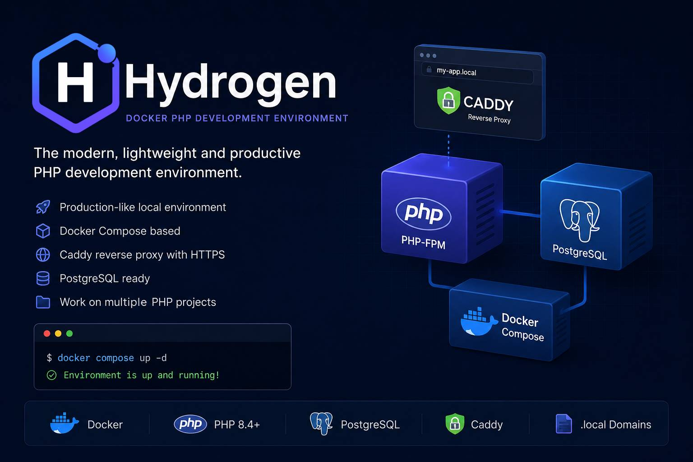

<p align="center">
  
</p>

<p align="center">
  A clean Docker development environment for PHP projects — powered by Caddy, PHP-FPM, PostgreSQL and Docker Compose.
</p>

<p align="center">
  <a href="https://github.com/kmukhamadulloev/Hydrogen/blob/main/LICENSE"></a>
  
  
  
  
</p>

## What is Hydrogen?

**Hydrogen** is a local-first Docker workspace for PHP development. It gives you a ready-made stack for running multiple PHP projects from one place without installing PHP, PostgreSQL or a web server directly on your host machine.

It is especially useful when you want a simple local environment with:

* **Caddy 2** as the web server and local reverse proxy
* **PHP 8.4-FPM** with common extensions already installed
* **PostgreSQL 16** for database-backed apps
* **Docker Compose** for repeatable service orchestration
* A shared `projects/` directory for your PHP apps
* Per-project Caddy virtual hosts like `my-app.local`

## Stack

| Service    | Image / Base         | Purpose                                                                |
| ---------- | -------------------- | ---------------------------------------------------------------------- |
| `caddy`    | `caddy:2-alpine`     | Serves local domains, static files and proxies PHP requests to PHP-FPM |
| `php`      | `php:8.4-fpm`        | Runs PHP applications with Composer and useful extensions              |
| `postgres` | `postgres:16-alpine` | Local PostgreSQL database                                              |

## Included PHP tooling

The PHP image includes Composer 2 and a development-friendly extension set:

* `bcmath`, `bz2`, `calendar`, `exif`
* `gd` with JPEG, WebP and FreeType support
* `intl`, `mbstring`, `opcache`, `pcntl`
* `pdo`, `pdo_pgsql`, `pgsql`
* `soap`, `xsl`, `zip`
* Xdebug

## Project structure

```text
hydrogen/
├── config/
│   └── php/
│       ├── Dockerfile
│       └── conf.d/
├── projects/
│   └── hydrofiler/
├── volumes/
│   ├── caddy/
│   │   └── Caddyfile.example
│   ├── php/
│   └── postgres/
├── .env.example
├── docker-compose.yml
└── README.md
```

| Path                | Description                                                        |
| ------------------- | ------------------------------------------------------------------ |
| `config/php/`       | PHP-FPM image configuration and custom `.ini` files                |
| `projects/`         | Put your PHP projects here; mounted to `/var/www` in Caddy and PHP |
| `volumes/caddy/`    | Caddy configuration directory mounted to `/etc/caddy`              |
| `volumes/php/`      | Optional PHP configuration volume                                  |
| `volumes/postgres/` | PostgreSQL data directory                                          |

## Requirements

* Docker
* Docker Compose plugin
* Linux, macOS or Windows with WSL2

## Quick start

Clone the repository:

```bash
git clone https://github.com/kmukhamadulloev/Hydrogen.git hydrogen
cd hydrogen
```

Create your environment file:

```bash
cat > .env <<EOF
UID=$(id -u)
GID=$(id -g)
POSTGRES_USERNAME=hydrogen
POSTGRES_PASSWORD=hydrogen
EOF
```

Create your Caddyfile:

```bash
cp volumes/caddy/Caddyfile.example volumes/caddy/Caddyfile
```

Start the stack:

```bash
docker compose up -d --build
```

Check running containers:

```bash
docker compose ps
```

## Add a local project

Create or copy a PHP project into `projects/`:

```bash
mkdir -p projects/demo/public
cat > projects/demo/public/index.php <<'PHP'
<?php
phpinfo();
PHP
```

Add a Caddy virtual host in `volumes/caddy/Caddyfile`:

```caddyfile
demo.local {
    tls internal
    root * /var/www/demo/public
    php_fastcgi php:9000
    file_server
}
```

Add the domain to your hosts file:

```bash
echo "127.0.0.1 demo.local" | sudo tee -a /etc/hosts
```

Reload Caddy:

```bash
docker compose exec caddy caddy reload --config /etc/caddy/Caddyfile
```

Open:

```text
https://demo.local
```

> Hydrogen uses Caddy's internal TLS for local domains in the example config. Your browser may ask you to trust the local certificate authority.

## Database connection

From your PHP application, use the Docker service name as the database host:

```env
DB_CONNECTION=pgsql
DB_HOST=postgres
DB_PORT=5432
DB_DATABASE=hydrogen
DB_USERNAME=hydrogen
DB_PASSWORD=hydrogen
```

From your host machine, connect through the exposed port:

```bash
psql -h 127.0.0.1 -p 5432 -U hydrogen
```

## Useful commands

```bash
# Start services
docker compose up -d

# Stop services
docker compose down

# Rebuild PHP image
docker compose build php

# Open shell in PHP container
docker compose exec php bash

# Run Composer inside PHP container
docker compose exec php composer install

# View Caddy logs
docker compose logs -f caddy

# View PHP logs
docker compose logs -f php

# View PostgreSQL logs
docker compose logs -f postgres
```

## Laravel example

```bash
docker compose exec php bash
cd /var/www
composer create-project laravel/laravel demo-laravel
```

Then add a Caddy host:

```caddyfile
demo-laravel.local {
    tls internal
    root * /var/www/demo-laravel/public
    php_fastcgi php:9000
    file_server
}
```

## Symfony example

```bash
docker compose exec php bash
cd /var/www
composer create-project symfony/skeleton demo-symfony
```

Then add a Caddy host:

```caddyfile
demo-symfony.local {
    tls internal
    root * /var/www/demo-symfony/public
    php_fastcgi php:9000
    file_server
}
```

## Security notes

Hydrogen is designed for local development. Before adapting it for public servers, review these points:

* Replace development credentials in `.env`.
* Do not expose PostgreSQL publicly unless you know exactly why.
* Configure real domains and production TLS settings in Caddy.
* Disable or restrict Xdebug in production-like environments.
* Review mounted volumes and file permissions.

## Roadmap ideas

* Add ready-made templates for Laravel, Symfony and plain PHP apps.
* Add Makefile shortcuts for common commands.
* Add optional Redis and Mailpit profiles.
* Add a healthcheck section for services.
* Add documentation for trusting Caddy's local CA.

## Contributing

Pull requests are welcome. If you want to improve the stack, documentation or default configs, open an issue or submit a PR.

## License

Hydrogen is open-source software licensed under the [MIT License](./LICENSE).
